<!-- Google tag (gtag.js) -->

<!-- _paginate: false -->

# 別等主線任務：用社群把你的支線升級成未來
## 2025 YS 青年論壇《我們不只寫程式，也在寫未來》
 
 

## Denny Huang
### 2025/09/20

---

# [https://denny.one/20250919-ysyct](https://denny.one/20250919-ysyct)

---

# Denny Huang

- 人生失敗，大同大學資工系沒畢業
- 失業仔，現在沒工作
- <a href="https://sitcon.org/" target="_blank">SITCON 學生計算機年會</a> 共同發起人, since 2012
- <a href="https://coscup.org/" target="_blank">COSCUP 開源人年會</a> 長期志工, since 2011
- <a href="https://hitcon.org/" target="_blank">HITCON 台灣駭客年會</a> 長期志工, since 2012
- <a href="hhtps://rayark.com/" target="_blank">雷亞遊戲</a> Data Analysis Manager, 2018 - 2025
- <a href="https://denny.one/" target="_blank">About me</a>

---

# 小六作文 〈相約十年後〉

---

# 夢想？

---

# 國中畢業紀念冊

---

# 人家在準備會考，我在……
## 其實那時候叫基本學力測驗

---

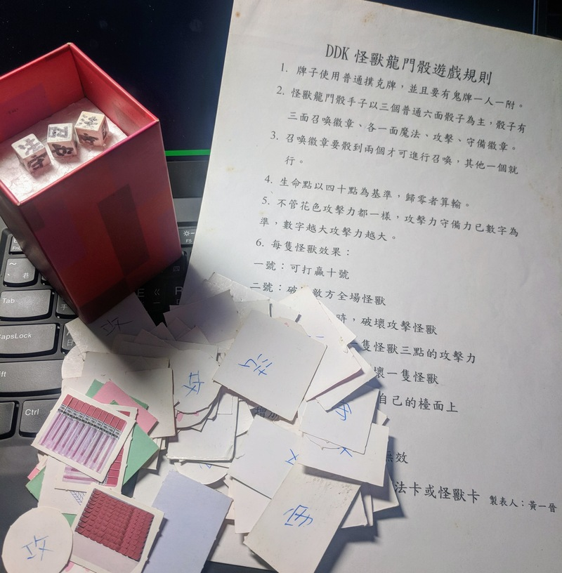

---

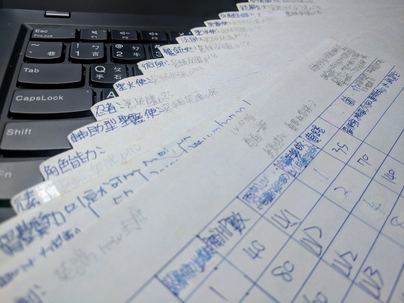

---

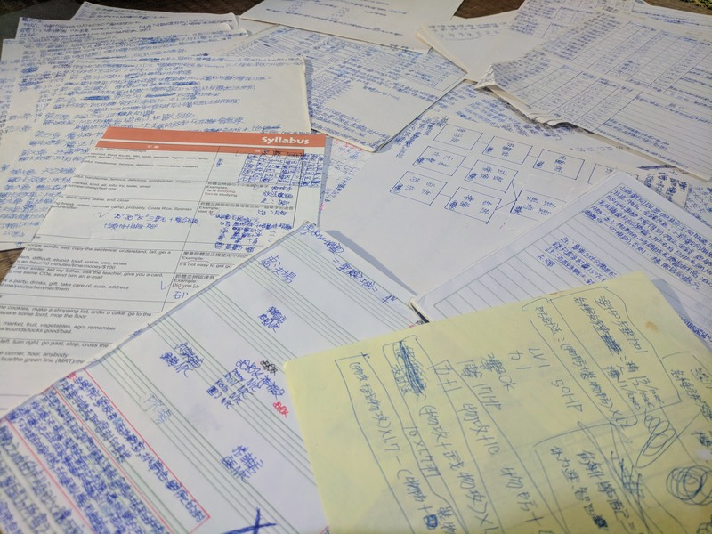

---

# 第一份打工?

---

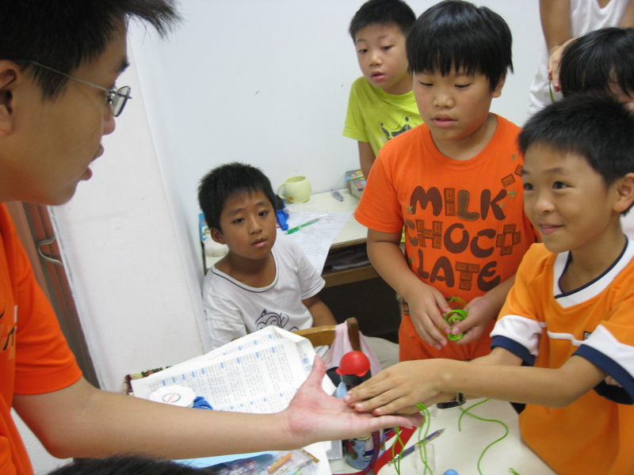

---

# 大學社團
## 魔術社/[資研社](https://ttucsc.denny.one/)

---

# 大學沒畢業

---

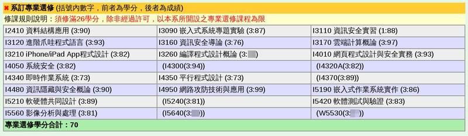

---

## Students’ Information Technology Conference
## https://sitcon.org

---

# [SITCON 2026](https://sitcon.org/)
2026/03/28
中央研究院 人文社會科學館

---

# 緣起
## https://hackmd.io/@SITCON/2nd-anniv

---

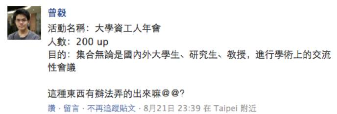

---

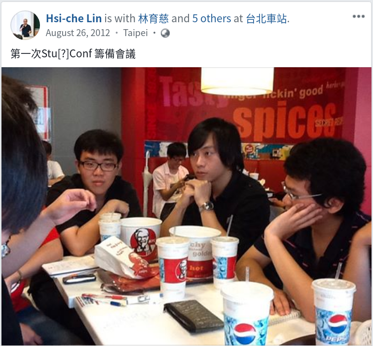

---

# 給學生一個發表的舞台。

---

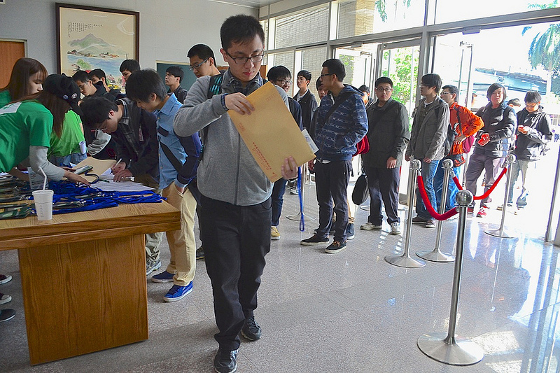

---

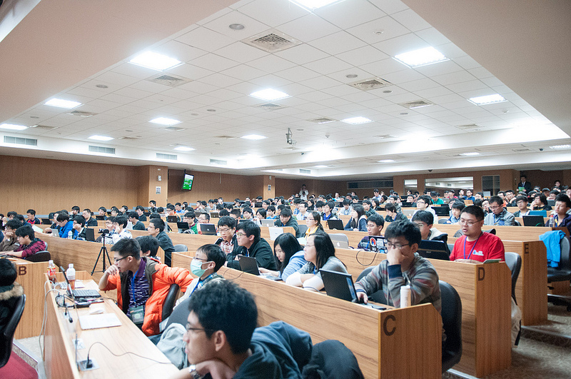

---

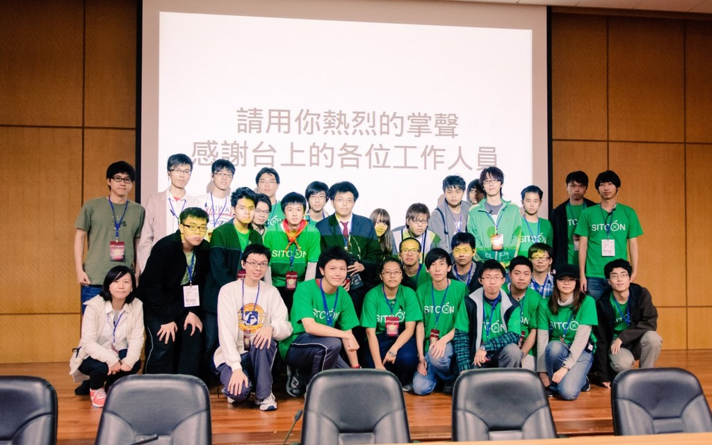

---

# 讓一群熱愛資訊的人有交流的機會。

---

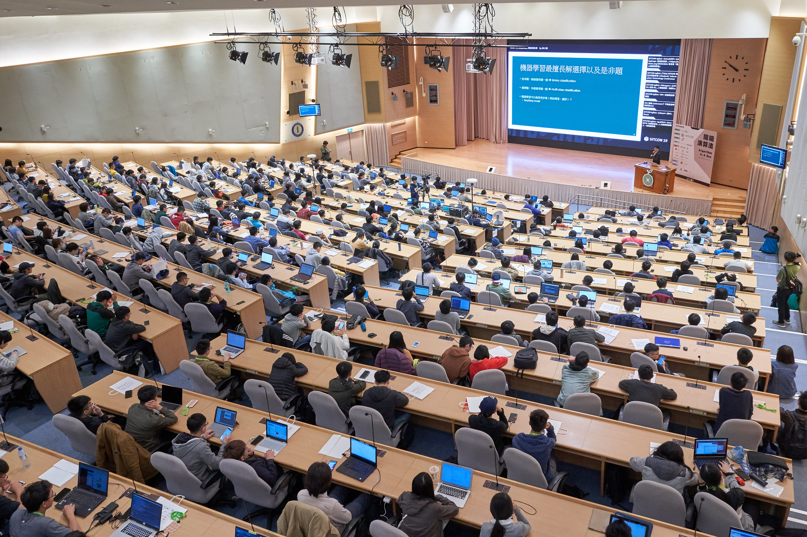

---

# 200 人 -> 1300 人

---

# 活動籌辦 -> 軟實力展現
- 溝通
- 團隊合作
- 專案管理
- 風險管理
- 領導力
- 危機處理
- ……

---

# SITCON 的公開資料
- [社群指南](https://sitcon.org/community-guide/)
- [各式文件存放處說明](https://sitcon.org/doc)
- [新人手冊](https://hackmd.io/@SITCON/join)
- [2026 籌備看板](https://gitlab.com/sitcon-tw/2026/board/-/boards/)
- [2026 籌備 wiki](https://gitlab.com/sitcon-tw/2026/board/-/wikis/home)
- [會議記錄](https://hackmd.io/@SITCON/minutes)

---

# [運算思維（Computational thinking）](https://zh.wikipedia.org/zh-tw/%E8%AE%A1%E7%AE%97%E6%80%9D%E7%BB%B4)
- 分解（decomposition）
- 模式識別/資料表示（pattern recognition）
- 泛化/抽象化（generalization / abstraction）
- 演算法（algorithms）

---

# AI 世代的重要能力
- 運算思維
- 獨立思考
- 駭客精神
- 多元觀點

---

# AI 世代的重要學門
- 社會科學
- 心理學
- 哲學

---

# 行動！

---

# Community
## [開源社群推廣目錄](https://hackmd.io/@SITCON/floss-community-list)

---

# [GDG](https://gdg.tw/) DevFest
- Taipei 11/30（日）
- Kaohsiung 11/22（五）

---

# [TOOCON](https://www.facebook.com/groups/toocon/)
10/14 | 每個月第二週的星期二晚上七點到九點，二個小時，二位講者

# [MOPCON 行動科技年會](https://mopcon.org/)
11/8, 9 | 國立高雄科技大學 楠梓校區

# [DevFest Kaohsiung X 南臺灣技術社群大聚 2025](https://gdg-kaohsiung.kktix.cc/events/devfest2025scs2025)
11/22, 23 | KO-IN 智高點

---

# Q&A

---

# Thanks for listening

 
 

###### 本投影片採用
 <a href="https://creativecommons.org/licenses/by-sa/4.0/deed.zh-hant" target="_blank">創用 CC「姓名標示-相同方式分享 4.0 國際」授權條款</a>釋出
 <a href="https://marp.app/" target="_blank">Marp</a> 製作
